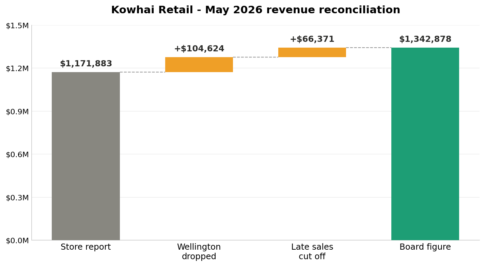

# Retail Revenue Reconciliation — Kōwhai Retail (May 2026)

Reconciled two conflicting revenue figures for a 12-store retailer, identified the correct number, and traced a **$170,995 discrepancy** to two root causes — using raw point-of-sale data.

**Tools:** Excel (PivotTables, data cleaning, waterfall chart) · data reconciliation · stakeholder reporting

---

## The problem

The board pack reported **~$1.34M** in May revenue, but an internal store summary reported **~$1.17M**. Leadership needed to know which figure was correct, and why they differed, ahead of a board meeting. I reconciled both against the raw POS transaction export (1,931 transactions).

## The result

The board figure of **$1,342,878 is correct.** The store summary understated revenue by **$170,995** for two reasons:

| Cause | Impact |
|---|---|
| A store renamed mid-month ("Wellington" → "Wellington CBD") was filtered out entirely | **$104,624** |
| The report was exported on 29 May, before month-end, dropping the last days of sales | **$66,371** |

## What I did

1. **Cleaned the raw data** — removed 8 duplicate refund rows (~$1,863) that would have distorted the total.
2. **Calculated true net sales** — `sales − refunds`, correcting a naïve total that double-counted refunds as revenue.
3. **Reconciled store-by-store** — compared the POS truth against the summary, isolating a systematic shortfall.
4. **Traced root causes** — identified the dropped store and the early export cutoff, confirming the latter with the data owner.
5. **Communicated the finding** — a one-page summary and a waterfall chart so any stakeholder gets the answer in seconds.

## Recommendations delivered

- Use the $1.34M board figure for May.
- Track stores by a permanent ID that survives renames, not by name.
- Run month-end reports only after the books close.
- Add a duplicate-row check to the export process.

## Files in this project

- `README.md` — this summary
- `reconciliation_bridge.png` — the waterfall chart
- `Project1_Case_Study.pdf` — a polished case-study version (tools, techniques, visual)
- `Project1_Reconciliation_Summary.md` — the full one-page manager report
- `data/Kowhai_POS_export_May2026.csv` — raw POS transaction data
- `data/Kowhai_Finance_summary_May2026.csv` — the flawed store summary

---

*Part of my data analytics portfolio. Skills demonstrated: data cleaning, reconciliation, root-cause analysis, and communicating findings to non-technical stakeholders.*
