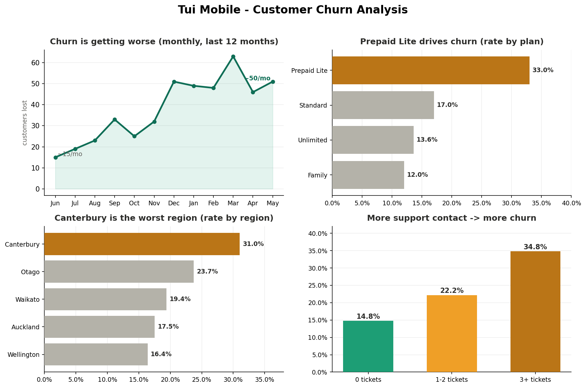

# Customer Churn Analysis — Tūī Mobile (SQL)

Analysed a telco's customer database to answer three questions for the Head of Growth: **is churn getting worse, what's driving it, and does support contact predict it?** Found churn had **tripled over 12 months**, concentrated in one plan and one region, with frequent support contact a strong warning sign.

**Tools:** SQL (SQLite) — `JOIN`, `GROUP BY`, CTEs, `LEFT JOIN`, conditional aggregation · metric definition · data visualisation

---

## The problem

The Head of Growth suspected churn was rising but had no agreed numbers, and wanted evidence to justify a retention budget. I queried the customer database (2,200 customers across three tables — `customers`, `plans`, `support_tickets`) to produce decision-ready answers.

## The results

Overall churn rate: **20.7%** (455 of 2,200 customers). Three findings:

| Question | Finding |
|---|---|
| Is churn getting worse? | **Yes — roughly tripled** over 12 months (≈15/month → ≈50/month). |
| What's driving it? | The **Prepaid Lite plan** (33% churn — half of all churners) and the **Canterbury region** (31%). |
| Does support contact predict churn? | **Yes** — customers with 3+ support tickets churn at **34.8%** vs **14.8%** for those with none. |

## How I did it

The analysis is in [`tui_churn_analysis.sql`](tui_churn_analysis.sql) — eight documented queries building from data exploration to the final result:

- **Defined the churn metric** explicitly (status = churned), since "churn" isn't a column — a key judgment call.
- **Monthly trend** with `strftime` date grouping and `GROUP BY`.
- **Churn rate by plan** using a `JOIN` to the `plans` table for readable names.
- **Churn rate by region** with conditional aggregation (`SUM(CASE WHEN ...)`).
- **Support-contact effect** using a **CTE** to count tickets per customer, then a **`LEFT JOIN`** to keep customers with zero tickets in the comparison.

Throughout I compared **churn rates, not raw counts** (so different-sized groups are fairly comparable) and flagged that the support–churn link is **correlation, not proof of cause**.

## Recommendations delivered

- Aim the retention budget at **Prepaid Lite customers** and the **Canterbury region** first — that's where the churn concentrates.
- **Proactively reach out** to customers after their 2nd–3rd support ticket, before they churn.
- Investigate *why* Prepaid Lite and Canterbury churn so heavily (pricing? coverage? a competitor?).

## Files in this project

- `README.md` — this summary
- `churn_dashboard.png` — the four key findings, visualised
- `tui_churn_analysis.sql` — the full, commented query script
- `tui_mobile.db` — the SQLite database (so the analysis is reproducible)
- `Project2_Findings.md` — the written findings memo

---

*Part of my data analytics portfolio. Skills demonstrated: SQL across multiple tables, defining metrics under ambiguity, churn analysis, and translating data into a business recommendation.*
