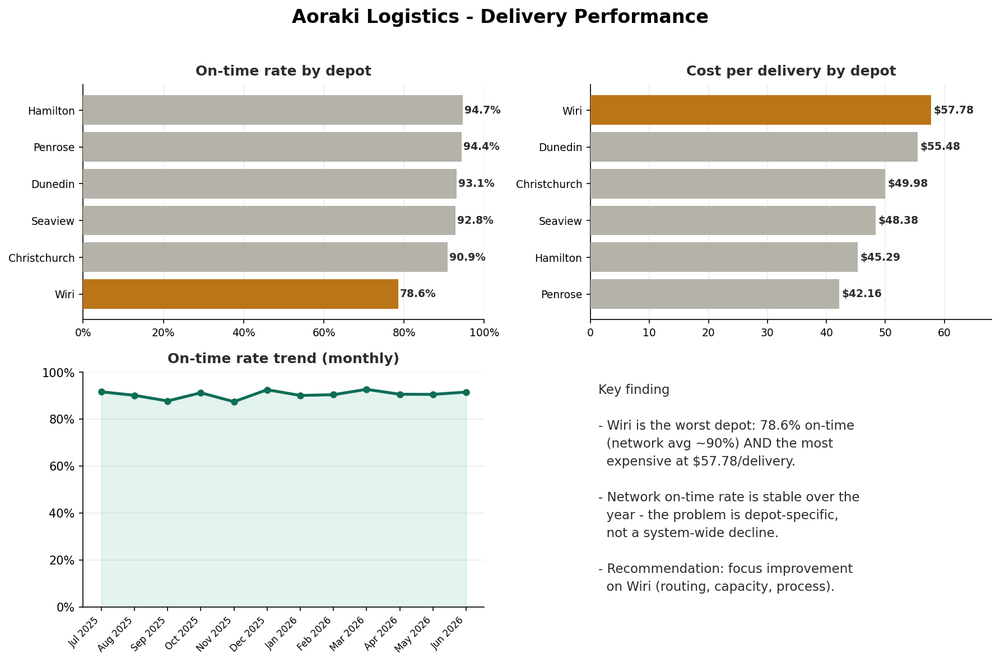

# Delivery Performance Dashboard — Aoraki Logistics (Tableau)

Built an interactive Tableau dashboard for a freight company, analysing **4,200 deliveries** across six depots to show on-time performance, cost efficiency, and the underperforming depot — designed so leaders can explore the numbers themselves instead of waiting for reports.

**Tools:** Tableau (calculated fields, dashboards, interactivity) · data visualisation · self-service reporting

---

## The problem

The GM was tired of waiting for analysts to email numbers. He wanted a single view he could open and filter himself, showing **on-time delivery rate, cost per delivery, and which depots are underperforming** across the Central/South region.

## The result

The dashboard surfaced a clear, actionable story:

| Finding | Detail |
|---|---|
| One depot is failing | **Wiri: 78.6% on-time** vs ~91–95% everywhere else |
| …and it's the most expensive | **Wiri: $57.78 per delivery**, the highest of all depots |
| It's not a network-wide trend | On-time rate is **stable (~90%)** across the year — the problem is depot-specific |

**Recommendation:** focus improvement on Wiri (routing, capacity, process) rather than spreading effort across the whole network — one depot is dragging down both service and cost.

## How I built it

- Created a **calculated field** for on-time rate (`SUM(IF [Status]="On time" THEN 1 ELSE 0 END) / COUNT([Status])`) — the same conditional-aggregation logic as a SQL `CASE WHEN`.
- Built three linked views: on-time rate by depot, average cost per delivery by depot, and a monthly on-time trend.
- Combined them into a single dashboard with a clear title and consistent formatting, sorted so the worst performers stand out immediately.

## Files in this project

- `README.md` — this summary
- `aoraki_dashboard.png` — the dashboard (key views)
- `data/aoraki_deliveries.csv` — the source delivery data (4,200 records)
- *Live interactive version: (Tableau Public link to be added)*

---

*Part of my data analytics portfolio. Skills demonstrated: building calculated fields, designing clear dashboards, and turning operational data into a focused recommendation.*
