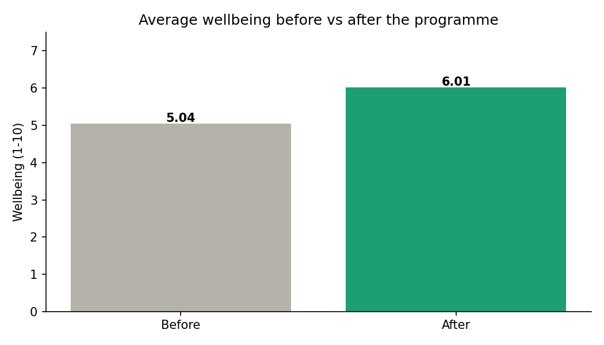

# Project 4 — Python Data Cleaning & Analysis (pandas)

**Skill focus:** Python / pandas — cleaning genuinely messy real-world data, then analysing it.
**Tool:** Jupyter Notebook (you already have it via Anaconda).
**Data:** `data/survey_online.csv` and `data/survey_paper.csv`

---

## The scenario (your ticket)

You're an analyst at **Pōhutukawa Health**. A programme team ran a year-long community wellbeing initiative and collected survey data two ways — an online form and paper forms keyed in by volunteers. Each person rated their wellbeing **before** and **after** the programme (1–10). The funder wants to know: **did participants improve?** But the data is a mess — two files, different column names, ages typed as words, duplicates, missing values, and mixed date formats.

> *"We have all this survey data but it's in two different files and honestly it's a nightmare. Can you clean it up and tell us whether participants improved? Funder wants it by month-end."*

---

## What you'll learn

Loading data, merging two differently-shaped files, cleaning messy columns (types, duplicates, missing values, text inconsistencies), computing a result, charting it, and writing an honest summary.

---

## Step-by-step

### 1. Set up the notebook
Open Jupyter (Terminal → `jupyter notebook`, or Anaconda Navigator). New Python 3 notebook. Save it in this project folder as `cleaning_analysis.ipynb`. In the first cell:

```python
import pandas as pd
import matplotlib.pyplot as plt

online = pd.read_csv("data/survey_online.csv")
paper  = pd.read_csv("data/survey_paper.csv")
print(online.shape, paper.shape)
online.head()
```

Run it (Shift+Enter). Look at both with `online.head()` and `paper.head()` — notice the **column names are different** between the two files.

### 2. Make the two files match
The two sources describe the same things with different column names. Rename `paper`'s columns to match `online`:

```python
paper = paper.rename(columns={
    "ID": "respondent_id",
    "Age": "age",
    "Region": "region",
    "Score_Before": "wellbeing_before",
    "Score_After": "wellbeing_after",
    "Date": "date",
})
```

### 3. Combine them into one table

```python
df = pd.concat([online, paper], ignore_index=True)
print("Combined rows:", len(df))
```

### 4. Remove duplicate rows
Some rows were entered twice:

```python
before = len(df)
df = df.drop_duplicates()
print("Removed", before - len(df), "duplicate rows")
```

### 5. Clean the `age` column (words → numbers, blanks)
Some ages are text like "forty" and some are blank. Convert to numbers; anything that can't convert becomes missing (`NaN`):

```python
df["age"] = pd.to_numeric(df["age"], errors="coerce")
print("Missing ages:", df["age"].isna().sum())
```
*(For this analysis age isn't critical, so leaving those as missing is fine — but note it in your write-up. This is a real judgement call.)*

### 6. Standardise the `region` text
Some regions are UPPERCASE. Make them consistent:

```python
df["region"] = df["region"].str.title().str.strip()
print(df["region"].unique())
```

### 7. Clean the dates (mixed formats)
Let pandas parse mixed formats; unparseable ones become missing:

```python
df["date"] = pd.to_datetime(df["date"], errors="coerce", dayfirst=True)
```

### 8. Sanity-check the wellbeing scores
Make sure scores are valid numbers in range 1–10:

```python
df = df[(df["wellbeing_before"].between(1,10)) & (df["wellbeing_after"].between(1,10))]
```

### 9. The actual analysis — did people improve?

```python
df["improvement"] = df["wellbeing_after"] - df["wellbeing_before"]

print("Avg before:", round(df["wellbeing_before"].mean(), 2))
print("Avg after: ", round(df["wellbeing_after"].mean(), 2))
print("Avg improvement:", round(df["improvement"].mean(), 2))
print("% who improved:", round((df["improvement"] > 0).mean()*100, 1), "%")
```

### 10. Visualise it

```python
fig, ax = plt.subplots(figsize=(7,4))
ax.bar(["Before","After"], [df["wellbeing_before"].mean(), df["wellbeing_after"].mean()],
       color=["#B4B2A9","#1D9E75"])
ax.set_title("Average wellbeing before vs after the programme")
ax.set_ylabel("Wellbeing (1-10)")
plt.savefig("before_after.png", dpi=150, bbox_inches="tight")
plt.show()
```

### 11. Export the cleaned data

```python
df.to_csv("cleaned_survey.csv", index=False)
```

---

## What to deliver (your portfolio piece)
- `cleaning_analysis.ipynb` — the notebook (the work)
- `before_after.png` — the chart
- `cleaned_survey.csv` — the cleaned output
- `README.md` — your write-up (template below)

## Write-up template (fill in `README.md`)
Copy this into a `README.md` in this folder and fill the blanks with YOUR numbers:

```
# Community Wellbeing — Data Cleaning & Impact Analysis (Python)

Cleaned and merged two messy survey files (online + paper) for a health programme,
then measured whether participants' wellbeing improved.

**Tools:** Python (pandas, matplotlib), Jupyter

## The problem
Survey data arrived in two files with different column names, word-based ages,
duplicates, missing values and mixed date formats. The funder needed to know
whether the programme improved participant wellbeing.

## What I did
- Merged two differently-structured files into one dataset
- Removed __ duplicate rows
- Converted text ages to numbers and standardised region names
- Parsed mixed date formats and validated wellbeing scores

## What I found
- Average wellbeing rose from __ to __ (a gain of __ points)
- __% of participants improved


## Honest caveats
- __ ages couldn't be parsed and were left as missing
- (any other limitations)

## Files
- cleaning_analysis.ipynb, before_after.png, cleaned_survey.csv
```

## Add to GitHub
1. github.com/zen-smh/data-analytics-portfolio → **Add file → Upload files**
2. Drag the **`project-4-python-data-cleaning`** folder in (with your notebook, chart, cleaned CSV, README).
3. Commit with message `Add Project 4: Python data cleaning`.
