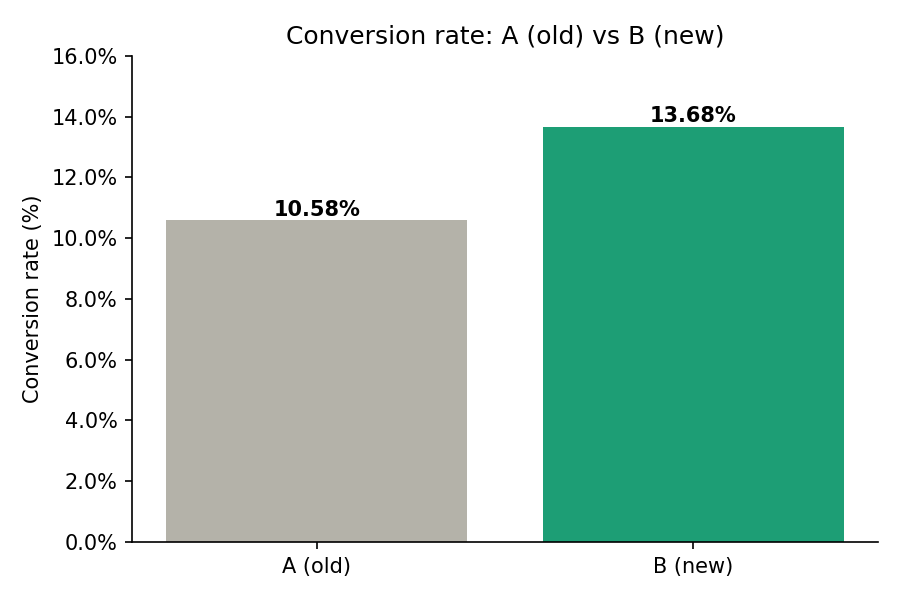

# Project 7 — A/B Test Analysis (statistics)

**Skill focus:** Statistics — comparing two groups and deciding if a difference is **real or just luck** (hypothesis testing). This is a skill many analysts lack, so it stands out.
**Tool:** Jupyter Notebook (Python).
**Data:** `data/ab_test_results.csv` (8,000 users: `group` A or B, `converted` 0/1)

---

## The scenario (your ticket)

You're an analyst on a marketing team. They tested two versions of a checkout page:
- **Group A** saw the old page.
- **Group B** saw a new design.

> *"Group B looks like it converted better — but is that real, or just random noise? Should we roll out the new page to everyone? Give me a clear yes/no with the stats to back it."*

---

## The concept (read this first)

When B looks better than A, it might be a **genuine improvement** or just **chance** (flip 10 coins twice, you won't get the same number of heads). Statistics answers: *"if there were truly no difference, how likely is a gap this big by luck alone?"* That likelihood is the **p-value**.

- **p-value < 0.05** → the difference is **statistically significant** (unlikely to be luck) → trust it.
- **p-value ≥ 0.05** → not significant → could be noise → don't roll out on this alone.

The 0.05 threshold is the standard convention.

---

## Step-by-step

### 1. Set up
New Jupyter notebook in this folder, `ab_test_analysis.ipynb`:

```python
import pandas as pd
df = pd.read_csv("data/ab_test_results.csv")
print(df.shape)
df.head()
```

### 2. Conversion rate per group

```python
summary = df.groupby("group")["converted"].agg(["count", "sum", "mean"])
summary.columns = ["users", "conversions", "conversion_rate"]
summary["conversion_rate"] = (summary["conversion_rate"]*100).round(2)
summary
```
This gives each group's users, conversions, and conversion rate (%). Note the gap between A and B.

### 3. The significance test (two-proportion z-test)

```python
from statsmodels.stats.proportion import proportions_ztest

conversions = [df[df.group=="B"].converted.sum(), df[df.group=="A"].converted.sum()]
users       = [len(df[df.group=="B"]),            len(df[df.group=="A"])]

stat, pvalue = proportions_ztest(conversions, users)
print("p-value:", round(pvalue, 5))
```

### 4. Interpret it

```python
if pvalue < 0.05:
    print("Significant — B's improvement is real. Recommend rolling out the new page.")
else:
    print("Not significant — could be noise. Don't roll out on this data alone.")
```

### 5. Chart it

```python
import matplotlib.pyplot as plt
rates = df.groupby("group")["converted"].mean()*100
fig, ax = plt.subplots(figsize=(6,4))
ax.bar(rates.index, rates.values, color=["#B4B2A9","#1D9E75"])
for i,v in enumerate(rates.values): ax.text(i, v+0.1, f"{v:.1f}%", ha="center", fontweight="bold")
ax.set_title("Conversion rate: A (old) vs B (new)")
ax.set_ylabel("Conversion rate (%)")
plt.savefig("ab_result.png", dpi=150, bbox_inches="tight")
plt.show()
```

---

## What you should find
Group B converts a few percentage points higher than A, and the p-value is **below 0.05** — so the new page is a real improvement. Your recommendation: **roll out version B.**

## What to deliver
- `ab_test_analysis.ipynb`, `ab_result.png`, `README.md`

## Write-up template (`README.md`)
```
# A/B Test Analysis — Checkout Page (Statistics)

Tested whether a new checkout page (B) converted better than the old one (A),
using a two-proportion z-test to confirm the result was statistically significant.

**Tools:** Python (pandas, statsmodels, matplotlib), hypothesis testing

## Result
- Group A (old): __% conversion
- Group B (new): __% conversion
- p-value: ____  → statistically significant (< 0.05)
- **Recommendation: roll out version B.**


## Why it matters
The difference wasn't just luck — the test shows it's a real effect, so the
business can act on it with confidence.

## Files
- ab_test_analysis.ipynb, ab_result.png
```

## Add to GitHub
Upload the **`project-7-ab-test-analysis`** folder. Commit: `Add Project 7: A/B test analysis`.
