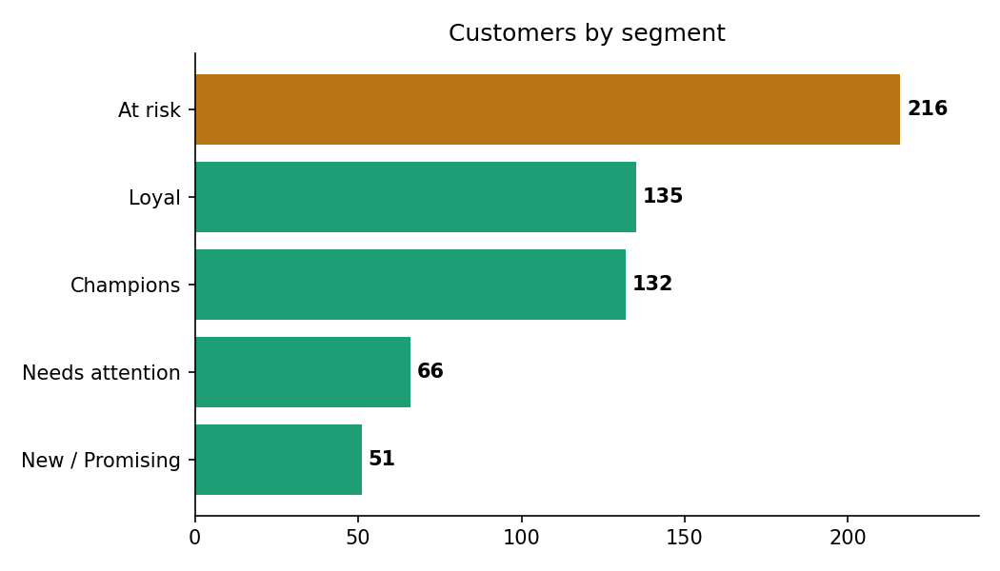

# Project 8 — Customer Segmentation (RFM analysis)

**Skill focus:** Turning raw transactions into customer **segments** marketers can act on — a very employable, real analytics task.
**Tool:** Jupyter Notebook (Python).
**Data:** `data/transactions.csv` (customer_id, order_date, amount)

---

## The scenario (your ticket)

You're an analyst supporting a marketing team. They want to stop emailing everyone the same thing.

> *"Can you group our customers by how valuable and engaged they are? I want to know who our best customers are, who's about to leave, and who's new — so we can target each group differently."*

---

## The concept — RFM

**RFM** scores every customer on three things:
- **Recency** — how recently did they buy? (recent = good)
- **Frequency** — how often do they buy? (often = good)
- **Monetary** — how much have they spent? (more = good)

Score each 1–5, and the combination tells you the segment (e.g., high on all three = "Champion"; bought once long ago = "At risk").

---

## Step-by-step

### 1. Load and prep

```python
import pandas as pd
df = pd.read_csv("data/transactions.csv", parse_dates=["order_date"])
print(df.shape); df.head()
```

### 2. Set a "today" snapshot date
Recency is measured from a reference date — use the day after the last order:

```python
snapshot = df["order_date"].max() + pd.Timedelta(days=1)
```

### 3. Build the RFM table (one row per customer)

```python
rfm = df.groupby("customer_id").agg(
    recency   = ("order_date", lambda x: (snapshot - x.max()).days),
    frequency = ("order_date", "count"),
    monetary  = ("amount", "sum"),
).reset_index()
rfm["monetary"] = rfm["monetary"].round(2)
rfm.head()
```

### 4. Score each dimension 1–5
Lower recency is better, so its scoring is reversed:

```python
rfm["R"] = pd.qcut(rfm["recency"], 5, labels=[5,4,3,2,1]).astype(int)
rfm["F"] = pd.qcut(rfm["frequency"].rank(method="first"), 5, labels=[1,2,3,4,5]).astype(int)
rfm["M"] = pd.qcut(rfm["monetary"], 5, labels=[1,2,3,4,5]).astype(int)
rfm["RFM_score"] = rfm["R"] + rfm["F"] + rfm["M"]
```

### 5. Assign readable segments

```python
def segment(row):
    if row["RFM_score"] >= 13: return "Champions"
    if row["RFM_score"] >= 10: return "Loyal"
    if row["R"] >= 4:          return "New / Promising"
    if row["R"] <= 2:          return "At risk"
    return "Needs attention"

rfm["segment"] = rfm.apply(segment, axis=1)
rfm["segment"].value_counts()
```

### 6. Summarise and chart

```python
import matplotlib.pyplot as plt
counts = rfm["segment"].value_counts()
fig, ax = plt.subplots(figsize=(7,4))
ax.barh(counts.index[::-1], counts.values[::-1], color="#1D9E75")
ax.set_title("Customers by segment")
plt.savefig("segments.png", dpi=150, bbox_inches="tight")
plt.show()

rfm.to_csv("rfm_segments.csv", index=False)
```

---

## What to deliver
- `rfm_analysis.ipynb`, `segments.png`, `rfm_segments.csv`, `README.md`

## Write-up template (`README.md`)
```
# Customer Segmentation — RFM Analysis

Scored customers on Recency, Frequency and Monetary value to group them into
actionable segments (Champions, Loyal, At risk, New) for targeted marketing.

**Tools:** Python (pandas, matplotlib)

## What I found
- __ Champions (best customers — reward & retain)
- __ At risk (were valuable, going quiet — win-back campaign)
- __ New / Promising (nurture)


## Recommendation
Target each segment differently: __ (e.g., loyalty perks for Champions,
win-back offers for At risk).

## Files
- rfm_analysis.ipynb, rfm_segments.csv, segments.png
```

## Add to GitHub
Upload the **`project-8-customer-segmentation`** folder. Commit: `Add Project 8: customer segmentation`.
