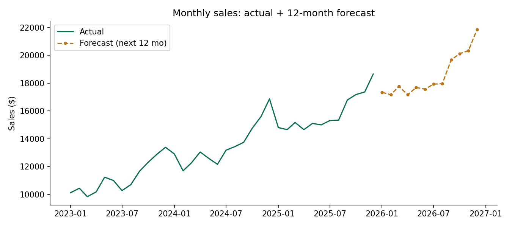

# Project 9 — Sales Forecasting (time series)

**Skill focus:** Time-series analysis — spotting **trend** and **seasonality**, and making a **forecast**. Forecasting is a high-value skill that few junior analysts can do.
**Tool:** Jupyter Notebook (Python).
**Data:** `data/monthly_sales.csv` (3 years of monthly sales: `month`, `sales`)

---

## The scenario (your ticket)

You're an analyst at a retailer planning next year.

> *"Here are our monthly sales for the last three years. Is the business growing? Is there a seasonal pattern? And can you forecast the next 12 months so we can plan stock and staffing?"*

---

## The concepts
- **Trend** = the long-term direction (growing, flat, shrinking).
- **Seasonality** = a repeating pattern (e.g., a spike every December).
- **Forecast** = projecting the pattern forward.

---

## Step-by-step

### 1. Load and plot

```python
import pandas as pd
import matplotlib.pyplot as plt

df = pd.read_csv("data/monthly_sales.csv")
df["month"] = pd.to_datetime(df["month"])
df = df.set_index("month")

df["sales"].plot(figsize=(9,4), title="Monthly sales (3 years)")
plt.ylabel("Sales ($)"); plt.show()
```
Look at the chart: you should see an upward **trend** and a repeating yearly **seasonal** shape.

### 2. Smooth it to see the trend clearly (moving average)

```python
df["trend_12mo"] = df["sales"].rolling(12).mean()
df[["sales","trend_12mo"]].plot(figsize=(9,4), title="Sales with 12-month moving average")
plt.show()
```
The smooth line strips out seasonality so the growth trend is obvious.

### 3. Break it into trend + seasonality + noise (decomposition)

```python
from statsmodels.tsa.seasonal import seasonal_decompose
result = seasonal_decompose(df["sales"], model="multiplicative", period=12)
result.plot()
plt.tight_layout(); plt.show()
```
This splits the series into its three components so you can see each clearly.

### 4. Forecast the next 12 months (Holt-Winters)

```python
from statsmodels.tsa.holtwinters import ExponentialSmoothing

model = ExponentialSmoothing(df["sales"], trend="add", seasonal="mul", seasonal_periods=12).fit()
forecast = model.forecast(12)
print(forecast.round(0))
```

### 5. Chart history + forecast together

```python
fig, ax = plt.subplots(figsize=(9,4))
df["sales"].plot(ax=ax, label="Actual")
forecast.plot(ax=ax, label="Forecast", linestyle="--", color="#BA7517")
ax.set_title("Sales: actual + 12-month forecast"); ax.legend()
plt.savefig("forecast.png", dpi=150, bbox_inches="tight")
plt.show()
```

---

## What you should find
Sales are growing steadily (~1–2% a month underlying trend) with a clear **seasonal peak in November–December**. The forecast continues both the growth and the seasonal spikes.

## What to deliver
- `forecasting.ipynb`, `forecast.png`, `README.md`

## Write-up template (`README.md`)
```
# Sales Forecasting — Time Series Analysis

Analysed 3 years of monthly sales to identify trend and seasonality, then forecast
the next 12 months using Holt-Winters exponential smoothing.

**Tools:** Python (pandas, statsmodels, matplotlib)

## What I found
- Underlying trend: growing (~__% per month)
- Seasonality: peak in ______ each year
- Forecast: next 12 months projected (see chart)


## Why it matters
The retailer can plan stock and staffing around the predicted seasonal peaks
instead of guessing.

## Files
- forecasting.ipynb, forecast.png
```

## Add to GitHub
Upload the **`project-9-sales-forecasting`** folder. Commit: `Add Project 9: sales forecasting`.
